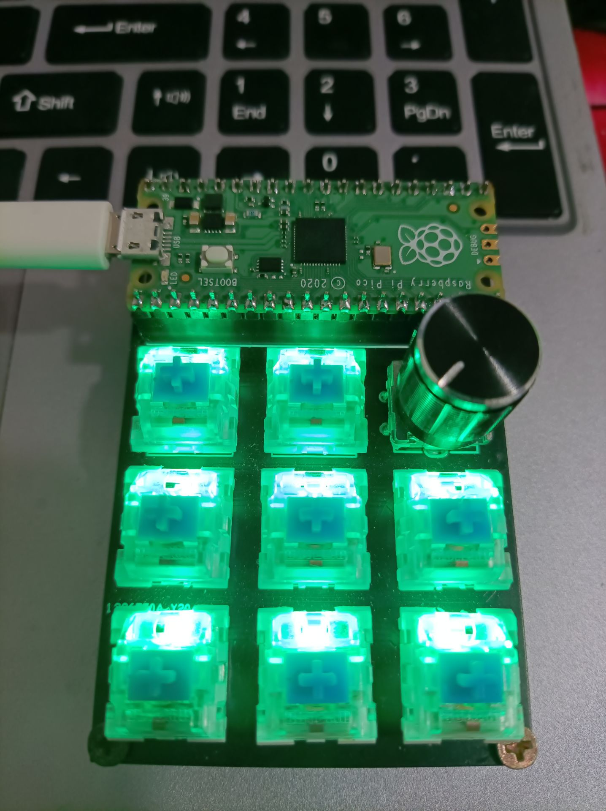
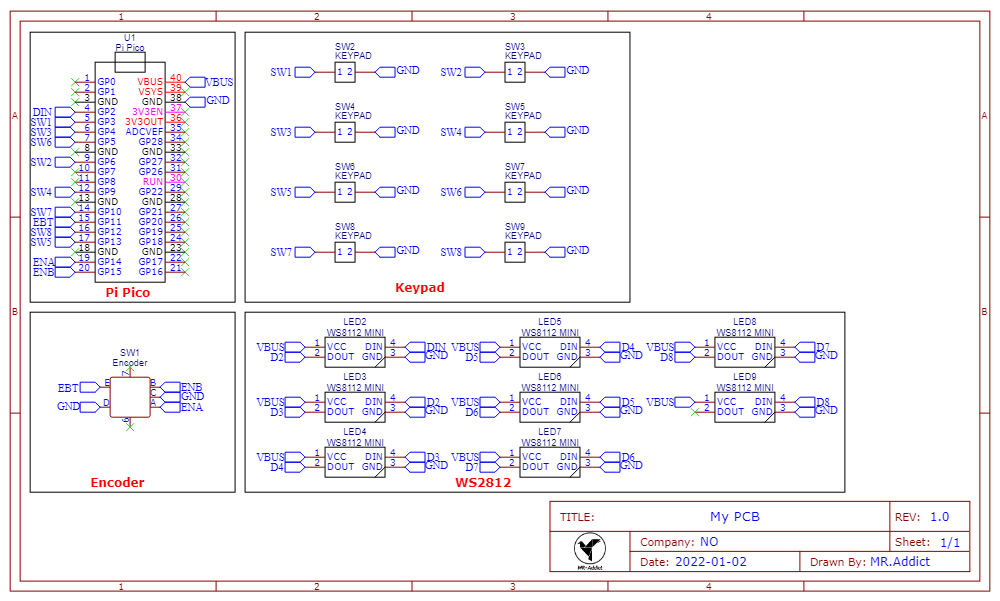

#  DIY Pi Pico MacroPad
# 1. Description
This a DIY Pi Pico MacroPad based on C/C++ SDK.

If you like C/C++ development instead of MacroPython, you must have a look on my project.



# 2. Needed Components & Schematic
- **Pi Pico Board** x1
- **Rotary Encoder** x1
- **Mechanical Key** x8
- **Mini WS2812** x8
- **DIY MacroPad board** x1



# 3.Drivers
In this projects, almost all of the components wee need to driver ourselves, thus it's a good chance to improve our skill on investigating and coding.

Next, I gonna to talk about detailed process about how to drive them.

## 3.1 Rotary Encoder & Mechanical Key
I believe that all of you know how use buttons, so I gonna skipp this part.

Though it's mechanical Key, but it's just some buttons which are more nice and expensive. Here is an example.

```cpp

int main() {
    Button button(11);
    Encoder encoder(14, 15);
    stdio_init_all();
    int8_t count = 0;
    while (true) {
        int8_t encoder_dir = encoder.getDirection();
        if (encoder_dir == 1) {
            count++;
            printf("%d,Encoder rotated CK!\n", count);
        } else if (encoder_dir == -1) {
            count--;
            printf("%d,Encoder rotated CCK!\n", count);
        }
        if (button.isPressed()) {
            count = 0;
            printf("%d,Button Pressed!\n", count);
        }
    }
    return 0;
}

```

You can find my library in `src/lib/Encoder` folder.

Note that this folder contains both button and encoder code.

## 3.2 WS2812
Due to WS2812 is a timing sensitive component, so I use `PIO(Programmable Input/Ouput)` which Pi Pico features.

I learned a lot about PIO and how to use, and search a lot information about how to drive WS2812.

And I think it's really really not easy to use them. You can follow bellow articals and code examples.

- [A closer look at Raspberry Pi RP2040 Programmable IOs (PIO) By Jadhav](https://www.cnx-software.com/2021/01/27/a-closer-look-at-raspberry-pi-rp2040-programmable-ios-pio/)

- [Raspberry Pico: Programming with PIO State Machines By Sebastian](https://medium.com/geekculture/raspberry-pico-programming-with-pio-state-machines-e4610e6b0f29)

- [Pi Pico Offical PIO example](https://github.com/raspberrypi/pico-examples/tree/master/pio/ws2812)

- [ForsakenNGS PicoLED library for ws2812 LEDs](https://github.com/ForsakenNGS/PicoLED)

And I suggest directily use my library or ForsakenNGS's library, that's would be an easy way. Just like below.

```cpp

RGB leds[LED_LENGTH];
WS2812 LEDStrip(leds, LED_PIN, LED_LENGTH);

```

You can find my library in `src/lib/WS2812` folder.

## 3.3 TinyUSB
Write C/C++ to make hid interface come true would be a nightmare, but luckily `TinyUSB` support RP2040, and it's an offical example in pico-sdk examples.

And it's easy to use them, you just need to initilize some fuctions, call `tud_task()` all time and use `tud_hid_keyboard_report()` to report key to your host like below.

```cpp

void hid_task(void) {
    if (tud_hid_ready()) {
        if (button.isPressed()) {
            uint8_t keycode[6] = {0};
            keycode[0] = HID_KEY_A;
            tud_hid_keyboard_report(REPORT_ID_KEYBOARD, 0, keycode);
        } else
            tud_hid_keyboard_report(REPORT_ID_KEYBOARD, 0, NULL);
    }
}

int main(void) {
    board_init();
    tusb_init();
    while (true) {
        tud_task();
        hid_task();
    }
    return 0;
}

```

You can have a look here [Pi Pico Offical TinyUSB example](https://github.com/raspberrypi/pico-examples/tree/master/usb/device/dev_hid_composite)

And you can find it in my `src/lib/tinyusb` folder.

## 3.4 FreeRTOS
Using FreeRTOS, you can manage multi tasks and similarily run them at the same time, and you just need to creat a task like this.

```cpp

void led_task(void* parameter) {
    while (true) {
        LEDStrip.fillSolid(CHSV(colorIndex++, 255, 255));
        LEDStrip.show();
        vTaskDelay(100 / portTICK_PERIOD_MS);
    }
}

int main(){
    xTaskCreate(led_task, "led_task", 128, NULL, 1, NULL);
    vTaskStartScheduler();
    return 0;
}

```

But you are not necessarily to use FreeRTOS in your project, if you are interested in how to setup FreeRTOS on raspberry pi pico, you can go to my another project [FreeRTOS on Raspberry Pi Pico](https://github.com/MR-Addict/FreeRTOS-on-Raspberry-Pi-Pico)

## 3.5 Custom Your MacroPad Key
I custom 8 keys on my macropad, and you can change it in `buttonkey` arrey.

``` cpp

uint8_t buttonkey[LED_LENGTH] = {
    HID_KEY_S,      HID_KEY_Z,  
    HID_KEY_C,      HID_KEY_X,      HID_KEY_V,  
    HID_KEY_HOME,   HID_KEY_DELETE, HID_KEY_END
};

```

That's all.Have a happy kacking day!